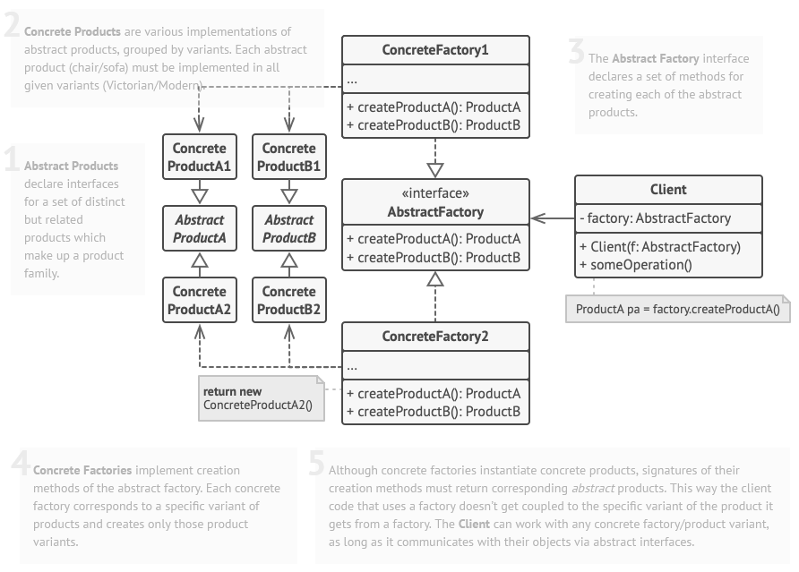

## [Abstract Factory Pattern](https://www.youtube.com/watch?v=v-GiuMmsXj4&list=PLrhzvIcii6GNjpARdnO4ueTUAVR9eMBpc&index=7)

[EXTRA VIDEO](https://www.youtube.com/watch?v=QNpwWkdFvgQ)

- Gebaseerd op de oef in de cursus

### Probleem

Maken van families van gerelateerde objecten → dp uitgelegd in een zinneke xd

Abstract factory pattern wordt gebruikt als je code moet werken met verschillende families van gerelateerde
objecten/producten.
Je wilt nog steeds de mogelijkheid hebben om de code te kunnen uitbreiden zonder dat je de code moet aanpassen zoals in
de simple factory pattern.

### Voorbeeld

Stel je moet een applicatie maken die op windows en mac werkt.
Je hebt een knop en een label(tekst) nodig op je schermen.
Implementatie van de knop en label is verschillend op windows en mac.
Hier gaan we een abstract factory voor gebruiken.

Hier zijn Win en Mac de families van gerelateerde objecten.
Button en Label zijn de objecten/producten die je nodig hebt.

- Win
  - WinButton
  - WinLabel
- Mac
  - MacButton
  - MacLabel

### Oplossing - Algemeen

1. Vind de families en de objecten die je nodig hebt.
2. Maak per product/object een interface. (gedrag)
3. Maak voor elke familie de bijhorende implementatie van de interface(s).
4. Maak een abstracte factory die de interface(s) als return type heeft. Create method per soort object.
5. Maak voor elke familie een concrete factory die de abstracte factory implementeert. En de juste concrete objecten
   maakt.
6. Inject de factory in de client

   

_NOTE: Kan zijn dat er meerdere verschillende abstract factories zijn._

### Voorbeeld Vervolg

> stappen komen overeen met de stappen in de algemene oplossing

1.  - Family: Win, Mac
    - Objecten: Button, Label
2.

```java
    public interface Button {
        public void show();
    }

```

```java
     public interface Label {
         public void show();
     }

```

3.

```java
     public class WinButton implements Button {
         @Override
         public void show() {
             System.out.println("WinButton");
         }
     }
```

```java
  public class WinLabel implements Label {
      @Override
      public void show() {
          System.out.println("WinLabel");
      }
  }
```

```java
  public class MacButton implements Button {
      @Override
      public void show() {
          System.out.println("MacButton");
      }
  }
```

```java
  public class MacLabel implements Label {
      @Override
      public void show() {
          System.out.println("MacLabel");
      }
  }
```

4.

```java
  public interface ScreenObjectFactory {
      public Button createButton();
      public Label createLabel();
  }
```

5.

```java
  public class WinScreenObjectFactory implements ScreenObjectFactory {
      @Override
      public Button createButton() {
          return new WinButton();
      }

      @Override
      public Label createLabel() {
          return new WinLabel();
      }
  }
```

```java
  public class MacScreenObjectFactory implements ScreenObjectFactory {
      @Override
      public Button createButton() {
          return new MacButton();
      }

      @Override
      public Label createLabel() {
          return new MacLabel();
      }
  }
```

6.

```java
  public class Client {
      private Button button;
      private Label label;

      public Client(ScreenObjectFactory factory) {
          button = factory.createButton();
          label = factory.createLabel();
      }

      public void show() {
          button.show();
          label.show();
      }
  }
```

```java
  public class Main {
      public static void main(String[] args) {
          ScreenObjectFactory factory = new WinScreenObjectFactory();
          Client client = new Client(factory);
          client.show();
      }
  }
```

Output:

```text
WinButton
WinLabel
```

```java
  public class Main {
      public static void main(String[] args) {
          ScreenObjectFactory factory = new MacScreenObjectFactory();
          Client client = new Client(factory);
          client.show();
      }
  }
```

Output:

```text
 MacButton
 MacLabel
```

> In cursus hebben ze ook een abstractie gemaakt bij de ScreenFactory. Klein verschil
> 

# [TERUG NAAR INHOUDSOPGAVE](../README.md)
