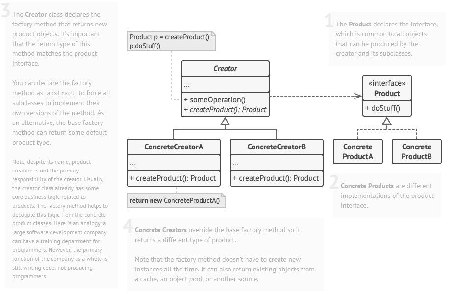

## [Factory Method Pattern](https://www.youtube.com/watch?v=EcFVTgRHJLM&list=PLrhzvIcii6GNjpARdnO4ueTUAVR9eMBpc&index=4)

### Probleem

Het fundamentele probleem van het Simple Factory Pattern is dat het een statische methode is. Dit betekent dat je niet
kan overerven van de factory. Dit is een probleem als je bijvoorbeeld een nieuwe vorm wil toevoegen. Je moet dan de
factory aanpassen. Dit is niet wenselijk.
Het Factory Method Pattern zorgt ervoor dat je makkelijker producten kan toevoegen zonder de factory aan te passen.

### Voorbeeld

Stel je hebt een burger restaurant. Je hebt dan verschillende soorten burgers op het menu.
Je wilt op een gegeven moment een nieuwe burger toevoegen. Je moet dan de factory aanpassen. Dit is niet ideaal.

### Oplossing - Algemeen

1. Maak een interface voor de producten
2. Maak een concrete product klasse die de interface implementeert
3. Maak een abstracte factory class, deze bevat een abstracte methode(s) die een object(en) van een bepaald type
   teruggeeft
4. Maak een/meerdere concrete factory(s) die de interface implementeert

> **Creator = factory**


### Voorbeeld Vervolg

> stappen komen overeen met de stappen in de algemene oplossing

1. ```java
    public interface Burger {
         void prepare();
    }
    ```
2. ```java
    public class CheeseBurger implements Burger {
        @Override
        public void prepare() {
            System.out.println("CheeseBurger is prepared");
        }
    }
    ```
3. ```java
    public abstract class BurgerFactory {
        public abstract Burger createBurger();
    }
    ```
4. ```java
    public class CheeseBurgerFactory extends BurgerFactory {
        @Override
        public Burger createBurger() {
            return new CheeseBurger();
        }
    }
    ```

   ```java
    public class Main {
        public static void main(String[] args) {
            BurgerFactory burgerFactory = new CheeseBurgerFactory();
            Burger burger = burgerFactory.createBurger();
            burger.prepare();
        }
    }
    ```
   Output:
    ```
    CheeseBurger is prepared
    ```
   Je kan nu makkelijk een nieuwe burger toevoegen zonder de factory aan te passen.
    ```java
    public class Hamburger implements Burger {
        @Override
        public void prepare() {
            System.out.println("Hamburger is prepared");
        }
    }
    ```
   ```java
    public class HamburgerFactory extends BurgerFactory {
        @Override
        public Burger createBurger() {
            return new Hamburger();
        }
    }
    ```
   ```java
    public class Main {
        public static void main(String[] args) {
            BurgerFactory burgerFactory = new HamburgerFactory();
            Burger burger = burgerFactory.createBurger();
            burger.prepare();
        }
    }
    ```
   Output:
    ```
    Hamburger is prepared
    ```
   > > Restaurant is in het voorbeeld hierboven de BurgerFactory
   

# [TERUG NAAR INHOUDSOPGAVE](../../README.md)
