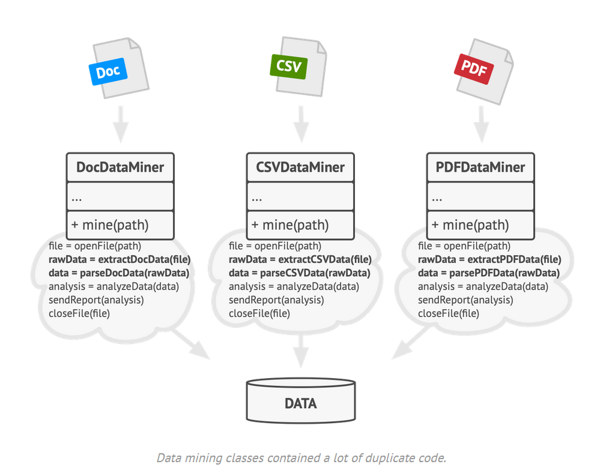
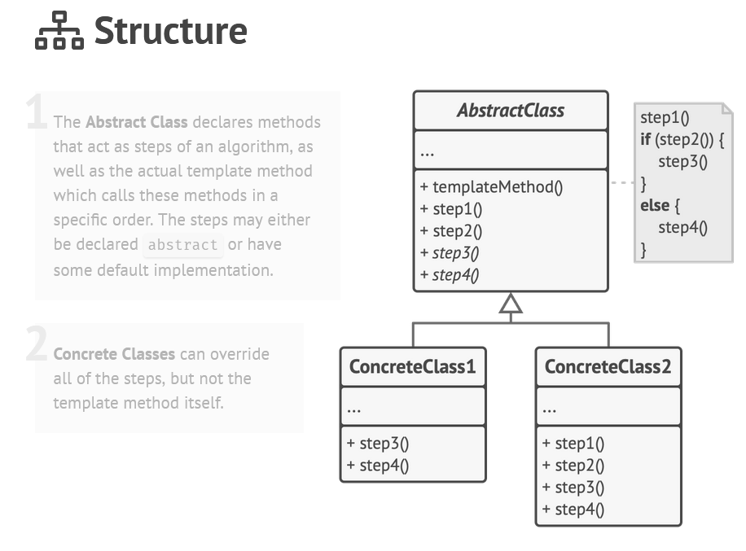

## [Template Method Design Pattern](https://www.youtube.com/watch?v=7ocpwK9uesw)

Het Template Method-ontwerppatroon is een gedragspatroon in objectgeoriënteerd programmeren dat het definiëren van het
skelet van een algoritme mogelijk maakt en de implementatie van bepaalde stappen aan subklassen overlaat. Het patroon
definieert een algoritme als een abstracte klasse en definieert methoden die bepaalde stappen van het algoritme
representeren.

De concrete subklassen implementeren deze methoden om de algoritme-stappen op een specifieke manier uit te voeren. Op
deze manier biedt het Template Method-patroon een manier om gemeenschappelijke functionaliteit te delen tussen
verschillende klassen, terwijl de specifieke implementatiedetails worden afgehandeld door de subklassen.

Het patroon wordt vaak gebruikt in frameworks en bibliotheken om gemeenschappelijke functies te bieden aan meerdere
gebruikers zonder dat elke gebruiker deze functies zelf hoeft te implementeren. Het biedt ook flexibiliteit omdat de
subklassen de implementatie van specifieke stappen kunnen aanpassen zonder de structuur van het algoritme te wijzigen.

### Probleem

Het Template Method-patroon lost het probleem op van het hergebruiken van code en het vermijden van duplicatie van code
in verwante klassen. Het kan vooral nuttig zijn wanneer verschillende klassen een gemeenschappelijke
basisfunctionaliteit delen, maar toch verschillende gedragingen hebben voor specifieke stappen van het algoritme.

> Duplicate code tegengaan

### Voorbeeld

### Oplossing

### Voorbeeld Vervolg

> stappen komen overeen met de stappen in de algemene oplossing

# [TERUG NAAR INHOUDSOPGAVE](../README.md)
