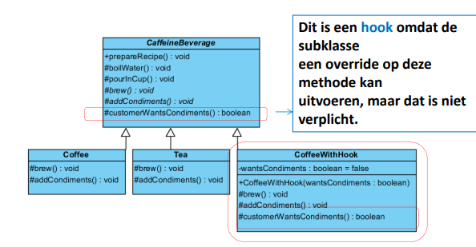
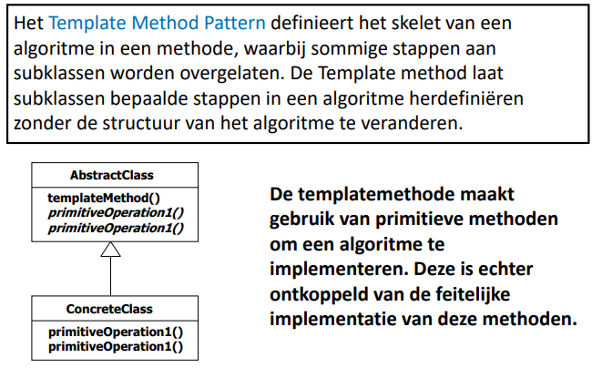

## [Template Method Design Pattern](https://www.youtube.com/watch?v=7ocpwK9uesw)

Het Template Method-ontwerppatroon is een gedragspatroon in objectgeoriënteerd programmeren dat het definiëren van het
skelet van een algoritme mogelijk maakt en de implementatie van bepaalde stappen aan subklassen overlaat. Het patroon
definieert een algoritme als een abstracte klasse en definieert methoden die bepaalde stappen van het algoritme
representeren.

De concrete subklassen implementeren deze methoden om de algoritme-stappen op een specifieke manier uit te voeren. Op
deze manier biedt het Template Method-patroon een manier om gemeenschappelijke functionaliteit te delen tussen
verschillende klassen, terwijl de specifieke implementatiedetails worden afgehandeld door de subklassen.

Het patroon wordt vaak gebruikt in frameworks en bibliotheken om gemeenschappelijke functies te bieden aan meerdere
gebruikers zonder dat elke gebruiker deze functies zelf hoeft te implementeren. Het biedt ook flexibiliteit omdat de
subklassen de implementatie van specifieke stappen kunnen aanpassen zonder de structuur van het algoritme te wijzigen.

### Probleem

Het Template Method-patroon lost het probleem op van het hergebruiken van code en het vermijden van duplicatie van code
in verwante klassen. Het kan vooral nuttig zijn wanneer verschillende klassen een gemeenschappelijke
basisfunctionaliteit delen, maar toch verschillende gedragingen hebben voor specifieke stappen van het algoritme.

> Duplicate code tegengaan


### Voorbeeld

Het bereiden van een drankje is een algoritme dat bestaat uit verschillende stappen. De stappen zijn ongeveer hetzelfde
voor elk drankje, maar de implementatie van elke stap kan verschillen. Het Template Method-patroon kan worden gebruikt
om de stappen van het algoritme te definiëren en de implementatie van elke stap aan subklassen over te laten.

### Oplossing

1. Definieer een abstracte klasse
   - Template methode die de stappen van het algoritme definieert
   - Concrete methoden die de stappen van het algoritme implementeren
   - Hook methoden die de stappen van het algoritme implementeren
2. Definieer een concrete klasse
   - Implementeer de concrete methoden
   - Implementeer de hook methoden

> Hooks
> 
> hierop kun je een if statement zetten om te kijken of je de hook wilt uitvoeren of niet




### Voorbeeld Vervolg

> stappen komen overeen met de stappen in de algemene oplossing

1. ```java
   public abstract class beverage {
       public void prepareRecipe() {
           boilWater();
           brew();
           pourInCup();
           addCondiments();
       }
   
       public abstract void brew();
   
       public abstract void addCondiments();
   
       public void boilWater() {
           System.out.println("Boiling water");
       }
   
       public void pourInCup() {
           System.out.println("Pouring into cup");
       }
   }
   ```
2. ```java
   public class Tea extends beverage {
        @Override
        public void brew() {
             System.out.println("Steeping the tea");
        }
    
        @Override
        public void addCondiments() {
             System.out.println("Adding Lemon");
        }
   }
   ```
   ```java
    public class Coffee extends beverage {
         @Override
         public void brew() {
              System.out.println("Dripping Coffee through filter");
         }
     
         @Override
         public void addCondiments() {
              System.out.println("Adding Sugar and Milk");
         }
    }
    ```

    ```java
    public class Main {
         public static void main(String[] args) {
                  Tea tea = new Tea();
                  Coffee coffee = new Coffee();
         
                  tea.prepareRecipe();
                  coffee.prepareRecipe();
         }
    }
    ```
    ```
    Boiling water
    Steeping the tea
    Pouring into cup
    Adding Lemon
     
    Boiling water
    Dripping Coffee through filter
    Pouring into cup
    Adding Sugar and Milk
    ```

# [TERUG NAAR INHOUDSOPGAVE](../README.md)
